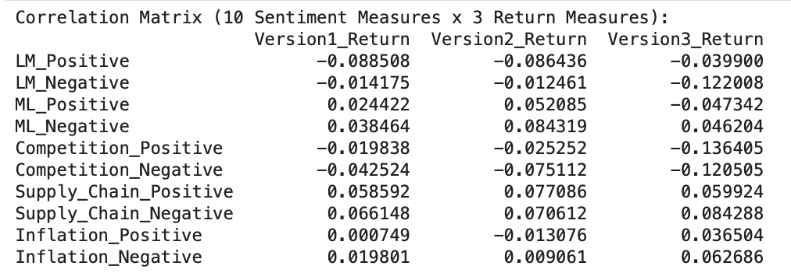

## About Me
As a Junior double majoring in Finance and Business Analytics with a minor in Graphic Design at Lehigh University, I thrive at the intersection of data, strategy, and leadership. I’m passionate about finding creative, data-informed solutions to complex problems, whether in the classroom or through extracurricular involvement.

On campus, I’ve taken on leadership roles that allow me to empower others and build community. As President of the Asian Business Community, I work to foster inclusion and professional growth among our members. I'm also actively involved in Lehigh's Student Senate, Scholars of Finance, and served as both an Orientation and Prelusion Leader—welcoming and mentoring new students as they begin their Lehigh journey.

<!-- Upload your own photo and change the path -->

---

## Portfolio

<!-- You can link to other websites, PDFs in this repo, and other pages in this repo -->

_**[Natural language processing 10-Ks to identify risks](midterm_summary)**_

I analyzed whether sentiment in 10-K filings is linked to stock returns. My hypothesis was that positive sentiment signals stronger company performance and better returns. I gathered 10-K filings for S&P 500 firms from the SEC's EDGAR database, processed them to clean the text, and merged the data with 2022 CRSP stock returns.

Next, I performed sentiment analysis using custom dictionaries focused on Competition, Supply Chain, and Inflation. I computed sentiment scores and added them to the dataset. To explore the relationship between sentiment and returns, I used a correlation matrix and heatmap, uncovering potential patterns between filing tone and stock performance.

---

_**[Regression Practice](Regression_practice)**_

Assignment #3: This heatmap represents the correlation between three variables: ret (returns), std (standard deviation), and cnt (count). It shows that these variables are largely uncorrelated with each other. Typically we would expect that higher volatility would lead to higher or lower returns but this shows no clear linear relationship.

---

## Career Objectives

Write what you want. 

Sell yourself!

---

## Hobbies

My hobbies include digital art, fitness, dance, and baking. Besides my academics, I love being involved with two dance teams on campus, JM Entertainment and the Polynesian Dance Team. I also like to create art in my free time. 

---
